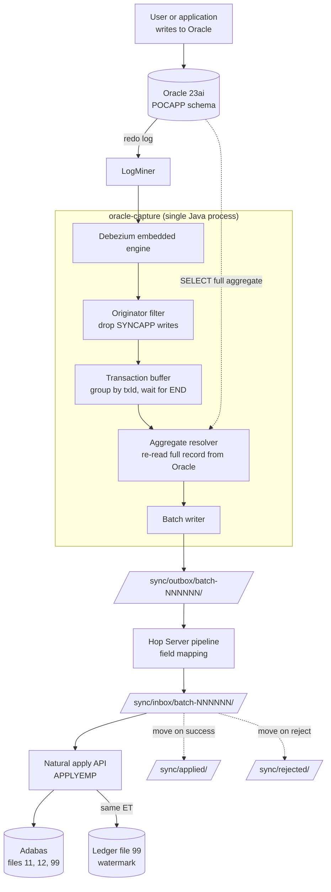
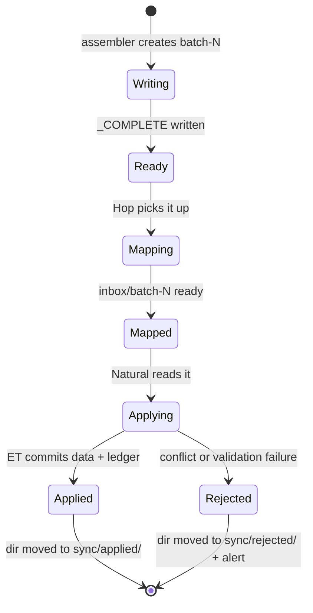
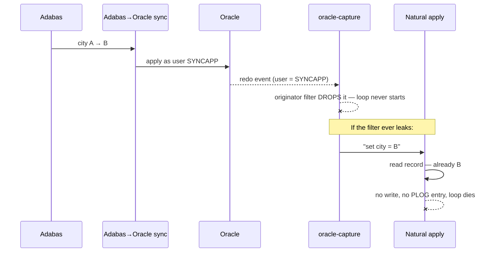
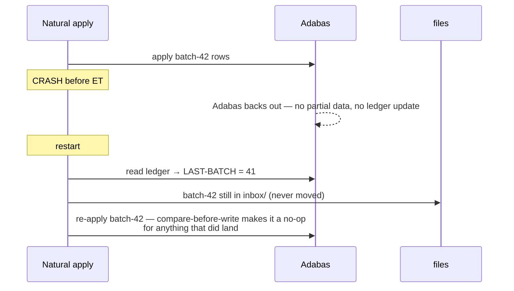

# Oracle → Adabas log-based synchronisation

**Status:** APPROVED — implementation started 2026-08-10; **all six gating spikes PASSED**
**Date:** 2026-08-09 (spikes recorded 2026-08-10)
**Scope:** Oracle to Adabas sync, one leg only (Oracle → Adabas). Lab implementation, production-faithful shape.
**Predecessor:** the migration lab (Adabas → Oracle bulk migration, `VERIFIED: 5/5`, 2026-08-05)

> ## ⚠️ Domain change, 2026-08-18 — read this before the rest
>
> This spec was written and executed against an **employee** aggregate: Adabas file 11
> `EMPLOYEES`, Oracle `EMPLOYEE` + address lines + languages + incomes. The migration lab
> then replaced its domain, and that model no longer exists in either database.
>
> **The synced aggregate is now the traffic fine:** Adabas file 20 `TRAFFINE`, Oracle
> `traffic_fine` + `traffic_fine_offence` (MU, offence codes from one stop) +
> `traffic_fine_payment` (PE, part payments). `APPLYFIN`/`DUMPFIN` replace
> `APPLYEMP`/`DUMPEMP`, three Hop pipelines replace four, and the fixed-width layouts are
> in `CHANGE_FILE_CONTRACT.md`.
>
> **Nothing architectural changed.** Decisions D1–D8, the six spike results and every
> cross-cutting concern below hold as written — the new aggregate has the same shape
> (a root, one MU, one PE), which is why the port was a rename plus new field lists.
> The examples in sections C4–C6 and §7 are left in their original employee terms
> **on purpose**: they are the record of what was designed and proven at the time, and
> rewriting them would quietly claim the spikes were run against data they never saw.
> Where you need the current layouts, the contract is authoritative, not this document.
>
> Two things genuinely gained rather than renamed:
> - **Amounts and dates travel as text** (`85.00`, `20230505`) end to end, converted in
>   Natural with `VAL()`. The employee aggregate had no packed decimal; this one does,
>   and a Hop numeric would render through the server locale.
> - **Three reverse code lookups instead of one** — status, offence and payment method.
>
> Still open, and now the largest single gap: the **vehicle** aggregate is defined in
> `AggregateDef` but disabled. Adabas file 12 holds one record *per plate*, so writing it
> back reconciles a set of records rather than occupancy inside one record, and plate
> removal has no clean answer yet (VIN is not a descriptor, and a removed plate takes its
> `SOURCE_ISN` with it).

---

## 1. Purpose

Prove that changes committed in Oracle can be captured **from the redo log**, mapped
back into the Adabas record structure, and applied to Adabas **through Natural business
logic** — without polling application tables, without a message broker, and without
commercial licensing.

If this works, Oracle to Adabas sync has both legs: the migration lab proved Adabas → Oracle, this proves
Oracle → Adabas.

### What this spec covers

- Oracle change capture via LogMiner + Debezium
- Transaction-aware assembly of row events into whole logical records
- A file-based change contract between the open-systems side and the mainframe side
- Field mapping in Apache Hop
- A Natural apply API that writes to Adabas through validation
- Loop prevention, idempotency, restart, outage behaviour

### What this spec does NOT cover

| Out of scope | Why | Where it goes |
|---|---|---|
| Adabas → Oracle leg | Already proven for bulk (the migration lab); CDC leg is separate | a later round |
| Conflict **resolution** | Needs a per-table business policy | Round 3 |
| Encoding / EBCDIC / codepages | Lab data is pure ASCII (the migration lab finding) | Round 3 |
| Dirty-data handling | Deferred by decision since the migration lab | Round 3 |
| Sub-second latency tuning | Target here is "seconds", not "sub-second" | Production hardening |
| Production volumes | Lab is ~1,900 records | Capacity study |

---

## 2. Architecture



### Key design decisions carried in from the brainstorm

| # | Decision | Rationale |
|---|---|---|
| D1 | Log-based capture, never polling | Sees deletes and intermediate states; zero load on app tables; SCN gives gap-free ordering |
| D2 | Files, not Kafka/ActiveMQ | Files are already a durable queue; no new infrastructure in an air-gapped shop |
| D3 | Debezium over hand-written LogMiner | It already solves transaction buffering, offset persistence, restart, schema change |
| D4 | **Debezium notifies; Oracle supplies the payload** | Re-reading the full aggregate makes MU/PE set replacement trivial and apply idempotent |
| D5 | Apply via Natural, not direct writes | Goes *through* business logic — the documented weakness of direct replication write-back |
| D6 | Loop prevention = originator filter at capture | Stateless; no ledger to keep consistent; the standard approach in replication products |
| D7 | Compare-before-write in the applier | Second line of defence; required anyway for safe file replay |
| D8 | Full-set replacement for MU/PE | Idempotent; avoids occurrence-renumbering corruption |

---

## 3. Component specifications

### C1 — Oracle prerequisites

Current lab state (probed 2026-08-09) and required state:

| Setting | Now | Required | How |
|---|---|---|---|
| Log mode | `NOARCHIVELOG` | `ARCHIVELOG` | `shutdown immediate` → `startup mount` → `alter database archivelog` → `alter database open` |
| Supplemental log (min) | NO | YES | `ALTER DATABASE ADD SUPPLEMENTAL LOG DATA;` |
| Supplemental log (PK) | NO | YES | `ALTER DATABASE ADD SUPPLEMENTAL LOG DATA (PRIMARY KEY) COLUMNS;` |
| Supplemental log (all) | NO | YES, on synced tables | `ALTER TABLE pocapp.employee ADD SUPPLEMENTAL LOG DATA (ALL) COLUMNS;` — needed for before-images |
| FRA size | default | sized + purge job | Lab dies in days if archive logs are never purged |
| Capture user | — | `C##DBZUSER` (common user, CDB) | Needs `LOGMINING`, `SELECT ANY TRANSACTION`, `SELECT` on synced tables |
| Apply-back user | — | `SYNCAPP` | Reserved for the future Adabas → Oracle leg; **the originator filter target** |

> **Container note:** mining runs against the **CDB root** (service `FREE`), while the
> tables live in `FREEPDB1`. Debezium handles this via `database.pdb.name=FREEPDB1`.

### C2 — Debezium connector configuration

Embedded engine, not Kafka Connect. Key properties:

```properties
connector.class                = io.debezium.connector.oracle.OracleConnector
database.hostname              = oracle
database.port                  = 1521
database.dbname                = FREE            # CDB root
database.pdb.name              = FREEPDB1        # where the tables are
database.user                  = C##DBZUSER

table.include.list             = POCAPP.EMPLOYEE,POCAPP.EMPLOYEE_ADDRESS_LINE,\
                                 POCAPP.EMPLOYEE_LANGUAGE,POCAPP.EMPLOYEE_INCOME,\
                                 POCAPP.VEHICLE

snapshot.mode                  = no_data         # the migration lab did the bulk load already
provide.transaction.metadata   = true            # BEGIN/END markers — required for D4
offset.storage.file.filename   = /sync/state/offsets.dat
```

`table.include.list` is the **scope lever**. In production it holds only the files
confirmed to be written on both sides.

### C3 — oracle-capture (assembler)

A single Java process. Four stages:

**1. Originator filter.** Drop every event whose originating DB user is the apply-back
user. Preferred: connector-level exclusion (recent Oracle-connector versions expose a
mining username exclude list — verify for the pinned version). Fallback: filter on the
event's `source.user_name` field. **Spike S2 decides which.**

**2. Transaction buffer.** Collect events keyed by `txId`. Release only when the `END`
marker arrives and its per-table counts match what was buffered. Never emit uncommitted
work; never split a transaction across batches.

**3. Aggregate resolver.** For each transaction, derive the set of **affected aggregate
roots**, then re-read each one in full from Oracle.

| Event on | Root key derivation |
|---|---|
| `EMPLOYEE` | `PERSONNEL_ID` from the event |
| `EMPLOYEE_ADDRESS_LINE` / `_LANGUAGE` / `_INCOME` | `EMP_ID` → look up `PERSONNEL_ID`, `SOURCE_ISN` |
| `VEHICLE` | `REG_NUM` + `SOURCE_ISN` from the event |

Employee aggregate definition — hand-written for now, shaped so it can become
configuration once a third aggregate proves the pattern:

```yaml
aggregate: employee
  root:         POCAPP.EMPLOYEE
  business_key: PERSONNEL_ID          # what Adabas knows it by
  lineage_key:  SOURCE_ISN            # fast path: READ ISN when present
  adabas_file:  11
  children:
    - table: EMPLOYEE_ADDRESS_LINE  fk: EMP_ID  order: LINE_NO  target: ADDRESS-LINE  # MU
    - table: EMPLOYEE_LANGUAGE      fk: EMP_ID  order: SEQ_NO   target: LANG          # MU
    - table: EMPLOYEE_INCOME        fk: EMP_ID  order: SEQ_NO   target: INCOME        # PE
```

Deletes are the exception: a deleted root cannot be re-read, so the event's **before-image**
supplies the key and the record is emitted as `op=D`.

**4. Batch writer.** Write one batch directory per flush (see C4).

### C4 — Change file contract

The stable interface between open systems and the mainframe. **Any change here is a
breaking change.** Deliberately mirrors `FLAT_FILE_CONTRACT.md` — same format rules, so
the Natural team works with one convention in both directions.

#### Format rules

- BOM-less UTF-8, comma-delimited CSV, one header row, RFC 4180 quoting.
- Empty string = NULL.
- One file per **target shape**, matching the migration lab's shapes reversed.
- Every row carries `op` (`U` = upsert full state, `D` = delete) and `tx_seq`
  (commit order within the batch — apply ascending).
- Child files carry `parent_key` (= `PERSONNEL_ID`) and `occurrence_index` (1-based).
- Child sets are **complete**: presence of any child row for a parent means
  "these are now *all* the occurrences". Absence of child rows for a parent with
  `op=U` means "the set is now empty".

#### Batch directory layout

```
sync/outbox/batch-000042/
    manifest.json              written first
    employee.csv
    employee_address_line.csv
    employee_language.csv
    employee_income.csv
    vehicle.csv
    _COMPLETE                  written LAST — the reader ignores directories without it
```

`_COMPLETE` is the commit point of the file protocol. Without it a consumer can read a
half-written batch.

#### manifest.json

```json
{
  "batch":          42,
  "created_utc":    "2026-08-09T13:22:11Z",
  "start_scn":      4283917,
  "end_scn":        4284102,
  "transactions":   7,
  "row_counts":     { "employee": 3, "employee_address_line": 8,
                      "employee_language": 4, "employee_income": 6, "vehicle": 1 }
}
```

#### employee.csv

| column | meaning | notes |
|---|---|---|
| op | `U` / `D` | |
| tx_seq | commit order in batch | apply ascending |
| personnel_id | business key | Adabas natural key |
| source_isn | Adabas ISN or empty | empty = record originated in Oracle → `STORE` |
| first_name, middle_name, last_name | | |
| birth_date | `YYYYMMDD` | Hop converts DATE → numeric |
| gender_code | `M`/`F` | |
| mar_stat | `S`/`M`/`D`/`W` | Hop reverses `MARITAL_STATUS` via `CODE_LOOKUP` |
| dept, job_title, city, postal_code, country | | |
| prev_* (optional) | before-image | conflict detection — see §5.4 |

#### employee_address_line.csv / employee_language.csv / employee_income.csv

| column | notes |
|---|---|
| parent_key | `PERSONNEL_ID` of the owning employee |
| occurrence_index | 1-based, contiguous, sorted |
| *(payload)* | `address_line` / `language_code` / `currency_code`+`salary_amount` |

#### vehicle.csv

| column | notes |
|---|---|
| op, tx_seq | |
| reg_num | business key |
| source_isn | empty = new record |
| personnel_id | owner link |
| make, model, color, year_built | |

### C5 — Hop field-mapping pipelines

Hop does what it did in the migration lab, in reverse. One pipeline per shape, driven by
`sync-apply.hwf`.

| Concern | Transform |
|---|---|
| Read batch CSV | CSV Input, `${BATCH_DIR}` variable |
| `MARITAL_STATUS` description → code | Database Lookup on `CODE_LOOKUP` — **same table, reversed keys** |
| DATE → `YYYYMMDD` numeric | Select Values, meta-data tab |
| Oracle column → Adabas field name | Select Values, rename |
| Trim to Adabas field lengths | Select Values / String operations |
| Write mainframe-facing CSV | Text File Output → `sync/inbox/batch-NNNNNN/` |

> **Cold-start constraint.** The migration lab measured ~30 s Hop JVM startup. Spawning `hop-run`
> per batch makes that the dominant latency. This lab therefore runs **Hop Server** — a
> long-lived JVM with pipelines triggered over REST. If Spike S6 shows Hop Server is
> awkward in the lab, fall back to invoking Hop once per *N* batches and accept the
> latency, or move field mapping into the assembler.

### C6 — Natural apply API

Program `APPLYEMP` (file 11), run via the same headless
interactive driver the migration lab established (Natural CE has no batch mode):

```
natural udb=1 madio=0 "etid=A$$" "stack=(LOGON APPLY;RUN APPLYEMP;FIN)" </dev/null
```

Per-record algorithm:

```
READ batch row
  ├─ locate record:  SOURCE_ISN present → READ ISN
  │                  else               → FIND by PERSONNEL-ID
  │
  ├─ not found + op=U ──► STORE (new record from Oracle)
  ├─ not found + op=D ──► no-op, count as already-applied
  │
  ├─ found + op=D ─────► DELETE
  │
  └─ found + op=U
        ├─ compare mapped values to current record  ────────► identical? SKIP, count no-op
        ├─ conflict check (§5.4)                    ────────► mismatch? write to rejected/
        └─ apply: scalar fields + replace MU/PE sets in full
             ├─ RESET <field>(n+1:max)   ◄── MANDATORY, see below
             ├─ set occurrences 1..n
             ├─ C*<field> := n
             └─ validate through existing business rules
END TRANSACTION  ── data + ledger record written in the SAME ET
```

> **⚠️ MU/PE shrink rule (proven by spike S4).** Lowering the count field alone does
> **not** remove trailing occurrences — they survive as stale residue *and the count
> stays put*. Occurrences above the new size must be `RESET` explicitly **before** the
> count is lowered:
>
> ```natural
> LANG(1) := 'FIN'
> RESET LANG(2:10)      /* without this, LANG(2)='ENG' and LANG(3)='GER' remain */
> C*LANG  := 1
> ```
>
> This is the single most dangerous detail in the apply path: get it wrong and the sync
> silently leaves Adabas holding occurrences Oracle no longer has, with no error anywhere.
> Test 4 in §7 exists to catch exactly this.
>
> **⚠️ A PE group is worse — reset every field in the group, including unmapped ones**
> (found 2026-08-10 while implementing `APPLYEMP`). A periodic-group occurrence stays
> alive while *any* field in it holds data. `INCOME` contains `CURR-CODE`, `SALARY` **and
> `BONUS`** — an MU nested inside the PE that this sync never maps, because the migration lab never
> extracted it. Resetting only the mapped fields left `C*INCOME = 3` with blank
> `CURR-CODE`/`SALARY`, because `BONUS(3,1) = 1179` survived:
>
> ```
> CINC=3
> OCC3  CURR=  SAL=0  CBONUS=1
>    BONUS(3,1)=1179      ◄── this alone keeps the occurrence alive
> ```
>
> Every field you would think to inspect looks empty while the count stays wrong. The
> apply program therefore declares `BONUS` purely so it can clear it.
>
> **Note the asymmetry.** For *surviving* occurrences the unmapped field must be left
> **untouched** — the read-modify-write preserves it, which is correct: Oracle has no
> opinion about a field it was never given. Only *removed* occurrences get the full wipe.
> This makes "which Adabas fields are not mapped?" a correctness question for the
> write-back leg, not just a completeness one — and it matters most on a long-lived
> legacy file, where decades of schema evolution guarantee unmapped fields exist.

**Adabas ledger — file 99** (new file, created by ADAFDU):

| field | purpose |
|---|---|
| `LAST-BATCH` | highest batch number fully applied |
| `LAST-SCN` | `end_scn` of that batch |
| `APPLIED-UTC` | timestamp |
| `ROWS-APPLIED` / `ROWS-SKIPPED` / `ROWS-REJECTED` | counters |

Written in the same `ET` as the data. That is what makes restart atomic — there is no
window in which data is applied but the watermark is not.

### C7 — Batch lifecycle



A batch directory is **never deleted by the producer**. It moves to `applied/` or
`rejected/` by the consumer. Directory rename on one filesystem is atomic — that is the
acknowledgement mechanism, and it is what makes files a real queue rather than a
hopeful one.

---

## 4. Sequence flows

### 4.1 Normal change

```mermaid
sequenceDiagram
    participant App as Oracle client
    participant O as Oracle
    participant C as oracle-capture
    participant F as file batch
    participant H as Hop Server
    participant N as Natural apply
    participant A as Adabas

    App->>O: UPDATE employee SET city='Tartu'<br/>+ 2 address lines; COMMIT
    O-->>C: redo → Debezium: 3 row events, 1 txId
    C->>C: buffer until END marker
    C->>O: SELECT full employee aggregate
    O-->>C: parent + all address lines / languages / incomes
    C->>F: write batch-42, then _COMPLETE
    F->>H: pipeline maps types, codes, field names
    H->>N: inbox/batch-42
    N->>A: READ ISN → compare → UPDATE + replace MU sets
    N->>A: ledger: LAST-BATCH=42, LAST-SCN=…  (same ET)
    N-->>F: mv batch-42 → applied/
```

### 4.2 Echo termination (once the return leg exists)



Two independent mechanisms. The filter is the efficiency play; the comparison is the
safety net. The **no-op counter is the leak detector** — in steady state it should sit
near zero.

### 4.3 Crash and restart



Nothing is lost, nothing is doubled. This is the payoff for D4, D7 and the
same-`ET` ledger write.

### 4.4 Adabas outage

The assembler keeps writing batches. `sync/inbox/` grows. Nothing is lost because
Debezium's offset file only advances as events are *written to a batch*, not as they are
applied. On recovery, Natural works through the backlog in batch order.

**Retention policy required:** monitor `inbox/` depth, alert at *N* batches, and define
what happens when disk fills. An unbounded outbox is the file-based equivalent of an
unbounded Kafka topic — it just fails less visibly.

---

## 5. Cross-cutting concerns

### 5.1 Loop prevention

Primary: **originator filter at capture** (D6). Stateless, no growth, no timing window.
Secondary: **compare-before-write** in the applier (D7). Rejected alternatives — content-hash
ledgers, RocksDB/Redis registries, push/pop stacks — all failed on the same two counts:
non-atomicity with the DB apply, and the silent-drop-on-revert failure.

### 5.2 Idempotency

Guaranteed by three properties together:

1. Full-state upsert, never deltas (D4/D8)
2. Compare-before-write (D7)
3. Watermark written in the same `ET` as the data (C6)

Consequence: **re-processing any batch is always safe.** That is the operational escape
hatch — when in doubt, replay.

### 5.3 Ordering

Within a batch, apply ascending `tx_seq`. Across batches, apply ascending batch number.
Never apply batch *N+1* before *N*. Single-threaded apply for this lab; parallelism by
aggregate key is a production-hardening topic.

### 5.4 Conflict detection *(stretch goal)*

Detection only — **no automatic resolution** in this lab.

The optional `prev_*` columns carry the Oracle before-image. On apply:

| Adabas current value matches | Meaning | Action |
|---|---|---|
| the new value | already applied | skip, count no-op |
| the before-image | expected state | apply |
| neither | someone changed Adabas independently | **write to `rejected/`, do not apply, alert** |

This costs nothing extra at runtime — the record is already in the buffer for the MU/PE
read-modify-write. It produces the "overridden changes report" the Oracle to Adabas sync design called for.

### 5.5 Latency budget

| Stage | Expected |
|---|---|
| Commit → Debezium emits | 1–2 s (LogMiner cycle) |
| Transaction buffer + aggregate re-read | < 1 s |
| Batch flush interval | **tunable — 5 s proposed** |
| Hop mapping (warm JVM) | < 1 s |
| Natural apply | < 1 s |
| **End to end** | **~5–10 s** |

Well inside "fast". Not sub-second, and honestly it need not be — the Oracle to Adabas sync analysis
already established that latency only matters where conflicts can occur.

---

## 6. Gating spikes

Ordered by risk. **Each is a kill-switch — run in order, stop on failure.** This mirrors
the migration lab, where the Natural CE batch-mode spike changed the design before implementation
started.

> **✅ ALL SIX SPIKES PASSED (S2 on 2026-08-09; S1, S3, S4, S5, S6 on 2026-08-10).**
> No gate changed the architecture. Two changed the *implementation*: S4 found that
> shrinking an MU/PE set needs an explicit `RESET` (silent corruption otherwise), and
> S6 measured the warm-JVM benefit at **54×**, confirming Hop Server rather than
> per-batch `hop-run`.

| # | Spike | Kills the design if | Result |
|---|---|---|---|
| ~~**S1**~~ | ~~`ARCHIVELOG` + supplemental logging on `gvenzl/oracle-free`, surviving restart; FRA sized and purged~~ | — | **✅ PASSED 2026-08-10** |
| ~~**S2**~~ | ~~Mine a known change: confirm `SQL_REDO` carries **PK predicates** (not ROWID) and `USERNAME` is **populated**~~ | — | **✅ PASSED 2026-08-09** |
| ~~**S3**~~ | ~~Debezium Oracle connector against 23ai Free: connect, emit events, verify transaction metadata markers~~ | — | **✅ PASSED 2026-08-10** |
| ~~**S4**~~ | ~~Natural CE program that **WRITES** to Adabas headlessly (`STORE`/`UPDATE`/`ET`)~~ | — | **✅ PASSED 2026-08-10 — 15/15** |
| ~~**S5**~~ | ~~Create ledger file 99 via `ADAFDU` in Adabas CE~~ | — | **✅ PASSED 2026-08-10 — 6/6** |
| ~~**S6**~~ | ~~Hop Server accepts REST-triggered pipeline execution~~ | — | **✅ PASSED 2026-08-10 — 0.4 s vs 23 s** |

### S2 result — PASSED 2026-08-09

Enabled `ADD SUPPLEMENTAL LOG DATA` (min + PK) database-wide and `(ALL) COLUMNS` on
`POCAPP.EMPLOYEE`; created user `SYNCAPP`; made one change as `POCAPP` and one as
`SYNCAPP`; mined from the CDB root with `DICT_FROM_ONLINE_CATALOG + COMMITTED_DATA_ONLY`.

| Requirement | Result |
|---|---|
| `USERNAME` populated | ✅ `[POCAPP]` and `[SYNCAPP]` — **distinguishes originators**, so the filter of §5.1 works as designed |
| `SQL_REDO` key predicates | ✅ real columns, not ROWID: `where "EMP_ID"='7029' and "SOURCE_ISN"='204' and "PERSONNEL_ID"='11100102' …` |
| **Before-image** | ✅ **bonus** — with `ALL COLUMNS`, every pre-change value appears in the `WHERE` clause → §5.4 conflict detection is free, `prev_*` columns no longer a stretch goal |
| `SRC_CON_NAME` | ✅ `FREEPDB1` while mining from CDB root — validates `database.pdb.name` in C2 |
| `XID` | ✅ populated — transaction grouping key available for C3 |
| Mining online redo in `NOARCHIVELOG` | ✅ works for a short window — S1 still needed for durability, but not blocking experimentation |

> **Capacity trade to raise with the DBA:** the before-image exists *because* of
> `ALL COLUMNS` supplemental logging, which increases redo volume on every update.
> Negligible in the lab; at production scale and write rates it is a real conversation.
> `PRIMARY KEY` alone gives the key predicate but **no before-image → no conflict detection**.

### S4 result — PASSED 2026-08-10 (15/15) — and it changed the apply algorithm

`natural/SPIKEWRT.NSP`, run head­lessly through the the migration lab stacked-command driver against
synthetic `PERSONNEL-ID 'ZZ999901'` (demo data untouched — verified `Records loaded: 1,107`
afterwards). `STORE`, `UPDATE`, `DELETE`, `END TRANSACTION`, `*ISN` after `STORE`, date
round-trip and MU/PE growth all worked first time.

> **⚠️ THE FINDING — silent MU/PE corruption.** Lowering the count field alone
> (`C*LANG := 1`) does **not** shrink the set. `natural/SPIKEMU.NSP` tested three idioms:
>
> | Strategy | Result |
> |---|---|
> | Lower `C*` only | ❌ count stayed 3; `LANG(2)='ENG'`, `LANG(3)='GER'` **survived as stale residue** |
> | `RESET` trailing occurrences, *then* lower `C*` | ✅ clean |
> | Empty the set, `ET`, refill | ✅ clean, but two updates and an intermediate empty state on the PLOG |
>
> **Rule for the apply API (C6): always `RESET <field>(n+1:max)` BEFORE lowering the
> count.** Decision D8 (full-set replacement) is sound, but the naive implementation of it
> corrupts data *silently* — the record looks fine, it just keeps occurrences the source no
> longer has. Strategy 2 is adopted; strategy 3 is rejected for the extra PLOG churn.

Also learned: an indented `*` is not a comment (must be column 1); `#OK := <condition>`
is rejected with NAT0300 — use `RESET` + `IF`; `CATALOG` on the stack needs an object
name (`CATALOG SPIKEWRT`) or it operates on the empty edit work area.

### S5 result — PASSED 2026-08-10 (6/6)

`ADAFDU` created file 99 (`SYNCLEDGER`) **online**, no nucleus restart, with the FDT in
`natural/LEDGER.fdt` and parameters in `natural/LEDGER.fdu`. `natural/SPIKELED.NSP` then
proved the file is usable from Natural: store, read back, update, and a 15-digit packed
`LAST-SCN` holding `999999999999999` without truncation (Oracle SCNs outgrow a 4-byte
integer, so this headroom is not theoretical).

> **Finding — DDM naming.** The DDM header name must match the *object* name
> (`LEDGER.NSD` → `DB: 000 FILE: 099 - LEDGER`), not the Adabas file name (`SYNCLEDGER`),
> or Natural cannot catalog it: NAT0082 "Object LEDGER does not exist in library". The migration
> lab never hit this because `VEHICLES` happened to match both. A DDM binds by file *number*.
> The header is also column-sensitive — line 3 must be a single space, and the name field
> keeps its trailing spaces.

### S1 result — PASSED 2026-08-10

`ARCHIVELOG` enabled, FRA sized (8 GB), min + PK supplemental logging database-wide,
`ALL COLUMNS` on all five synced tables, `C##DBZUSER` and `SYNCAPP` created. All of it
survived not just a `docker compose restart` but an **ungraceful daemon kill** — a
stronger test than planned. `ALTER PLUGGABLE DATABASE FREEPDB1 SAVE STATE` is required,
or the PDB stays `MOUNTED` after a manual startup cycle.

> **Finding — no `rman` in `gvenzl/oracle-free:23-slim`.** This is why archiving is
> pointed at a plain directory (`log_archive_dest_1`) instead of the FRA: with no `rman`,
> nothing can update the controlfile records for deleted logs, so FRA-managed archive logs
> would keep counting against `db_recovery_file_dest_size` even after deletion — and at
> 100% Oracle stops archiving and the database **hangs** (ORA-19809) with the disk half
> empty. `scripts/purge-archivelogs.sh` deletes by file age instead.
> *Production divergence, stated plainly: a full Oracle install has `rman`, and the
> standard answer there is FRA + an RMAN archivelog deletion policy driven by the
> connector's committed SCN.*

Also: `SHUTDOWN IMMEDIATE` deregisters the service from the listener, so the restart cycle
must run over a **local bequeath connection** (`sqlplus / as sysdba`) — a network connect
gets ORA-12514 on the following `STARTUP` and leaves the database down.

### S3 result — PASSED 2026-08-10

Debezium **3.6.1.Final** embedded engine (`capture/`), mining from CDB root `FREE` with
`database.pdb.name=FREEPDB1`. The decisive run was a *restart*: a multi-table transaction
committed while the connector was **stopped** was replayed from the persisted offset and
delivered correctly grouped —

```
TX BEGIN  id=04000500f1020000
DATA op=u table=EMPLOYEE               scn=8570183 user=[POCAPP] tx=04000500f1020000
DATA op=u table=EMPLOYEE_ADDRESS_LINE  scn=8570188 user=[POCAPP] tx=04000500f1020000
DATA op=d table=EMPLOYEE_LANGUAGE      scn=8570212 user=[POCAPP] tx=04000500f1020000
TX END    id=04000500f1020000 event_count=3 collections=[…EMPLOYEE_LANGUAGE:1, …EMPLOYEE:1, …EMPLOYEE_ADDRESS_LINE:1]
```

That single result validates four things at once: transaction grouping for D4, the `END`
marker's per-collection counts (how C3 stage 2 knows a transaction is complete), `op=d`
visibility, and restart-from-offset with no loss.

> **Findings — three build/config gates, all now scripted.**
> 1. `snapshot.mode=no_data` **still takes a schema snapshot**, which issues
>    `LOCK TABLE … IN ROW SHARE MODE` → ORA-41900. Fixed with
>    `snapshot.locking.mode=none` rather than granting the capture user `LOCK ANY TABLE` —
>    locking only protects a *data* snapshot, and we take none.
> 2. The connector maintains a `LOG_MINING_FLUSH` table in its own schema (to force an
>    LGWR flush), so it needs `CREATE TABLE` **and** a tablespace quota *inside the PDB* —
>    `QUOTA … CONTAINER=ALL` on `CREATE USER` does not propagate a usable quota.
> 3. `debezium-connector-oracle` pulls `ehcache → jaxb-runtime → javax.xml.bind:jaxb-api`,
>    which resolves only from `maven.java.net` — a dead repo whose TLS certificate expired
>    2026-04-02, so the build fails with a PKIX error unrelated to this project. `ehcache`
>    is excluded; it backs only the optional off-heap LogMiner buffer.

### S6 result — PASSED 2026-08-10 — the 54× that justifies the design

Hop Server runs from the same `apache/hop` image with the `sync` compose profile. Server
mode is selected by the **absence** of `HOP_FILE_PATH`/`HOP_COMMAND` — there is no explicit
mode flag. The endpoint is **`/hop/execPipeline`** (not `executePipeline`) with `runConfig=`,
and it is **synchronous**, which is what a batch-at-a-time mapping step wants.

| Path | Latency |
|---|---|
| Hop Server REST, warm JVM | **431 / 430 / 376 ms** |
| `docker compose run --rm hop-run`, cold | **23,223 ms** |

Per-batch `hop-run` would have spent 2–4× the entire 5–10 s end-to-end budget on JVM
startup alone. The C5 cold-start note is now measured rather than estimated.

> **⚠️ Pre-existing bug found and fixed (the migration lab was broken).** `hop/project-config.json`
> had `ORACLE_HOST = 127.0.0.1`. Hop **project variables override OS environment
> variables**, so that value silently defeated the `ORACLE_HOST=oracle` set by
> docker-compose: every container run failed with ORA-12541. The bug predates this lab — it
> came from the 2026-08-06 GUI session — and it meant `migrate.cmd` no longer worked.
> Restored to `oracle` (host-side runs override through the `local-gui` *environment*,
> the only layer that wins over a project default). **`migrate.cmd` verified back at
> `VERIFIED: 5/5`.**

### Lab side-effects

Spike rows and users are cleaned up as they go: both Natural spikes delete their synthetic
records, and `migrate.cmd` clears and reloads every target table. `SYNCAPP`, `C##DBZUSER`
and Adabas file 99 remain by design — the spec needs all three.

---

## 7. Success criteria

`sync-verify.cmd` prints `SYNC VERIFIED: n/n`, in the spirit of the migration lab's `VERIFIED: 5/5`.

> ### ✅ Current result: **SYNC VERIFIED: 9/10** (2026-08-10)
> Every test passes except #10, conflict detection — the documented stretch goal, gated on
> open decision **O2**. Assertions read Adabas through a separate dump program, never
> through the sync's own bookkeeping, so a test cannot pass by the pipeline agreeing with
> itself.

| # | Test | Pass condition | Result |
|---|---|---|---|
| 1 | Update a scalar field in Oracle | Adabas record shows new value within 15 s | ✅ |
| 2 | Insert a new employee in Oracle | New Adabas record stored; `'Married'` arrives as code `M`, proving the reverse `CODE_LOOKUP` ran | ✅ |
| 3 | Delete an employee in Oracle | Adabas record deleted | ✅ |
| 4 | Grow then shrink an MU set | Occurrences match the Oracle set exactly, contiguous from 1, **and the residue beyond the count is gone** (asserted past the count deliberately) | ✅ |
| 5 | Multi-table single transaction | Parent + children land together, never partially | ✅ |
| 6 | Replay an already-applied batch | Zero writes, no-op counter increments — run with the ledger guard **reset**, so it tests compare-before-write rather than the watermark short-circuit | ✅ |
| 7 | Write to Oracle as `SYNCAPP` | Change is **not** propagated (originator filter works) | ✅ |
| 8 | Crash between apply and acknowledgement | Batch re-applied cleanly, no duplicates, no loss | ✅ |
| 9 | Stop Adabas, make changes, restart | Changes queue in the outbox and drain in order after recovery | ✅ |
| 10 | Change the same record in both DBs *(stretch)* | Conflict detected, batch routed to `rejected/`, nothing silently overwritten | ⏸ **not implemented — O2** |

### Bugs found by the suite (all fixed)

The harness earned its keep on the first run, at 7/10:

1. **Delete rows had a different column set.** A delete emitted `op,tx_seq,personnel_id`
   while an upsert emitted 15 columns, so a delete-only batch could not be mapped. Deletes
   now carry the full column set with empty non-key values — the contract says a delete's
   other columns are *meaningless*, not *absent*.
2. **A child file with no rows was omitted entirely**, and the mapping step's CSV reader
   fails outright on a missing file. A new employee with no address lines is an ordinary
   case, so this broke every insert. Every known file is now written **header-only** when
   empty — which is also semantically required, since an empty child file means "the set
   is now empty", not "unchanged".
3. **⚠️ The pump skipped failed batches and carried on** — the worst of the three. Because
   the ledger refuses anything not newer than its watermark, applying batch *N+1* after
   batch *N* failed moved the watermark past *N*, and *N* could then **never** be applied:
   a permanent, silent gap in the synchronised data. The pump now **halts** at the first
   failure and says so. *Ordered delivery requires halting, not skipping.*

### Lab divergence — where the acknowledgement happens

The design has the applier rename the batch directory to `applied/` immediately after
`ET`. In this lab it cannot: Docker Desktop's Windows bind mount refuses a directory
rename from **inside** a container (`mv: Permission denied`) regardless of permissions,
while the host performs the same move fine — and a same-volume move on NTFS is atomic, so
the property the protocol depends on is preserved. `scripts/sync-pump.ps1` therefore
performs the acknowledgement based on the applier's exit code.

On a real Linux deployment this split would not exist. It costs nothing in correctness: a
crash between apply and acknowledgement leaves the batch in the inbox to be re-applied,
and re-applying is a no-op by construction (ledger watermark + compare-before-write) —
which is exactly what test 8 verifies.

---

## 8. Deliverables

```
oracle-to-adabas-sync/
├── specs/oracle-to-adabas-sync.md           this document
├── CHANGE_FILE_CONTRACT.md                  the file contract between the legs
├── oracle-init/01_schema.sql                target model (shared with the migration repo)
├── oracle-init/02_lookups.sql               CODE_LOOKUP seeds
├── oracle-init/03_cdc_setup.sql             users, grants, supplemental logging
├── oracle-init/04_seed.sql                  post-migration snapshot (see README)
├── capture/                                 Java: Debezium engine + assembler
│   ├── pom.xml
│   ├── capture-local.properties             runtime config (host-side)
│   └── src/main/java/com/example/o2a/capture/
├── hop/pipelines/60_sync_employee.hpl       reverse field mapping (parent)
├── hop/pipelines/70_sync_employee_address_line.hpl
├── hop/pipelines/71_sync_employee_language.hpl
├── hop/pipelines/72_sync_employee_income.hpl
├── hop/workflows/sync-apply.hwf
├── natural/APPLYEMP.NSP                     the apply API (writes through Natural)
├── natural/DUMPEMP.NSP                      reads Adabas state back, for assertions
├── natural/LEDGER.{fdt,fdu,NSD}             Adabas file 99, the apply watermark
├── natural/SPIKE*.NSP                       the MU/PE-corruption demonstrations
├── scripts/setup-cdc.ps1                    one-time Oracle CDC prerequisites
├── scripts/setup-adabas-ledger.ps1          one-time Adabas file 99 creation
├── scripts/sync-pump.ps1                    drives batches through map + apply
├── sync-verify.cmd                          the 10 criteria above
└── docker-compose.yml                       adabas, natural, oracle, hop-server
```

---

## 9. Open decisions

| # | Question | Owner | Blocks |
|---|---|---|---|
| ~~O1~~ | ~~`USERNAME` populated in `V$LOGMNR_CONTENTS`?~~ | — | **✅ RESOLVED 2026-08-09 — populated *and* distinguishes originators** |
| ~~O2~~ | ~~Conflict detection in this lab, or defer to round 3?~~ | Project owner | **✅ DECIDED 2026-08-10: defer to round 3.** This lab closes at 9/10 by intent, not by omission — see note |
| ~~O3~~ | ~~CSV or fixed-width for the mainframe-facing files?~~ | Implementation | **✅ DECIDED 2026-08-10 on evidence: fixed-width, mainframe-facing leg only.** See note below |
| ~~O4~~ | ~~Delete policy — do Oracle deletes physically delete in Adabas?~~ | Project owner | **✅ DECIDED 2026-08-10: yes, physical `DELETE`** — a POC-scope call. See note below |
| O5 | Which tables are *genuinely* written on both sides in production? | Design phase | `table.include.list` — dominates total effort |

O5 remains the highest-leverage question in the whole Oracle to Adabas sync effort: it decides whether
this is three aggregates or three hundred.

> **O2 note — DEFERRED TO ROUND 3 (project owner, 2026-08-10).** This lab therefore closes
> at **9/10 by intent**: the ten criteria stand as written, and #10 is explicitly out of
> scope for this round rather than an unmet goal. The priority now is learning and
> exercising each stage that *is* built — see `TESTING_GUIDE_POC2.md`.
>
> Round 3 already has the natural cluster for this: conflict detection joins dirty-data
> handling, encoding/codepages, and MU/PE before-images. That grouping is right — all four
> are "what happens when the data misbehaves" problems, and all four want the same
> forensic tooling.
>
> The sizing below is kept so round 3 starts from a known cost, not a blank page.
>
> **What it would cost (sized 2026-08-10).**
>
> Everything upstream already exists. `ALL COLUMNS` supplemental logging is on, so
> Debezium's `before` image arrives on every update at no extra cost, and the applier
> already reads the target record for the MU/PE read-modify-write. The work is:
>
> | Piece | Change |
> |---|---|
> | Assembler | keep the `before` image and emit `employee_prev.csv` |
> | Contract | one more fixed-width file, same shape minus `op`/`tx_seq` |
> | Hop | one more pipeline (a copy of `60_sync_employee`, same reverse code lookup) |
> | `APPLYEMP` | a `COMPARE-TO-PREV` subroutine and a third branch |
> | Pump | already routes a failed apply to `rejected/` — no change |
>
> The decision logic is the §5.4 table: Adabas matches the **new** value → already applied,
> skip; matches the **before-image** → expected state, apply; matches **neither** → someone
> changed Adabas independently, so reject and alert.
>
> Scope caveat if it goes ahead: compare the **parent scalars** only. Extending the
> before-image to MU/PE sets means reconstructing prior set state, which is a genuinely
> larger problem and belongs in round 3 regardless.
>
> **This is the last open item in this lab.** Everything else is built and verified.

> **O3 note — the format splits by leg, and that is the point.**
>
> | Leg | Format | Why |
> |---|---|---|
> | capture → Hop (`sync/outbox/`) | **CSV** | symmetry with the migration lab's `FLAT_FILE_CONTRACT.md`; Hop reads CSV natively |
> | Hop → Natural (`sync/inbox/`) | **fixed-width** | `READ WORK FILE` into a record structure parses positionally *for free* |
>
> Decided while writing `APPLYEMP.NSP`. Parsing CSV in Natural means hand-rolling
> `SEPARATE` with delimiter handling, quoted-field handling, and empty-field-vs-NULL
> handling — every one of which is a place to introduce a silent mis-parse in the leg
> that writes to the production database. With fixed-width, Natural's own
> `READ WORK FILE #REC` does the parsing, and a wrong layout fails loudly instead of
> shifting a value into the neighbouring field.
>
> Hop is happy to emit either, so the conversion costs nothing — it happens inside the
> mapping step that has to run anyway. Worth confirming with the Natural team that owns
> the target system, but as a preference, not a blocker: this is the mainframe-native
> choice and it is what existing mainframe tooling expects.

> **O4 note — decided for the POC, still open for production.** `op=D` performs a real
> Adabas `DELETE`. That is the right call for a lab: it makes test 3 in §7 unambiguous and
> keeps the apply path simple.
>
> It should **not** be carried into production unexamined. If the legacy database keeps no
> recoverable history for a given file, a propagated delete is unrecoverable from Adabas
> itself — and a delete arriving through a *sync* is a much easier thing to get wrong than
> a delete a user typed. The production alternatives are a logical-delete flag or a
> quarantine-then-delete window. Settle it as a business decision alongside O5.
>
> The apply program isolates this in one branch (`op=D` → `DELETE`), so switching to a
> logical delete is a localised change, not a redesign.

---

## 10. Relationship to off-the-shelf replication products

This design is not an argument against commercial Adabas↔RDBMS replication. It is a
costed, open-source alternative, and building it surfaced two questions that any
off-the-shelf tool has to answer too:

1. **Reverse MU/PE mapping.** How does a generic tool turn three child-row inserts in one
   Oracle transaction into a single Adabas record update? This spec needs an explicit
   aggregate definition (D4) to do it; a product must solve the same problem somehow.
2. **Business-logic bypass.** This design applies *through* Natural. Products that write
   directly into Adabas bypass whatever validation, derived fields and referential
   integrity live in the Natural layer — which, on a legacy system, is usually all of it.
